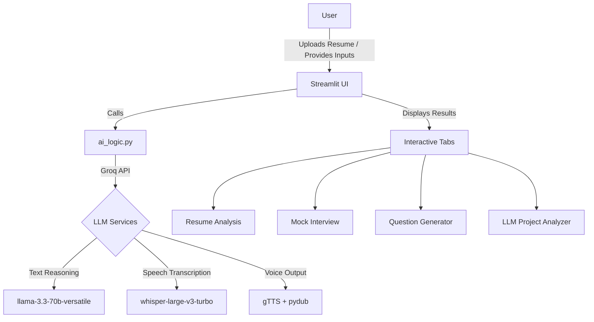
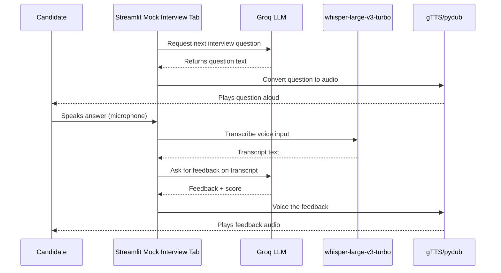

# HiredAI Virtual Placement Assistant

## Overview
HiredAI is an AI-powered placement assistant built with Streamlit. It combines multiple Groq LLM workflows to evaluate resumes, generate interview practice content, and simulate voice-driven mock interviews. The suite is designed for candidates preparing for placements, providing automated insights, personalized interview feedback, and GitHub project analysis in a single dashboard.

## Features
- **Resume Analysis**: Upload a PDF resume and compare it against a target job description. The app extracts resume text, evaluates strengths and weaknesses, and computes ATS-style keyword matches using Groq LLM prompts.
- **Voice-Based Mock Interview**: Conduct a conversational interview entirely by voice. Groq LLM generates interviewer questions; Groq Whisper (`whisper-large-v3-turbo`) transcribes microphone input, and gTTS/pydub handle text-to-speech playback with a Google Speech fallback if transcription fails.
- **Interview Question Generator**: Generate company- and role-specific question sets across domains such as DSA, SQL, System Design, Behavioral, AI/ML, and more. Solutions are produced automatically for quick revision.
- **LLM Project Analyzer**: Upload a resume and provide your GitHub username to cross-reference projects, validate repository matches, perform deep dives into README content, score authenticity, and derive interview-ready Q&A per project.
- **Project Interview Prompter**: Automatically generate follow-up questions and concise answers for each validated GitHub project using Groq LLMs, ideal for technical interview prep.
- **Groq-Powered Workflows**: Centralized use of Groq’s `llama-3.3-70b-versatile` for text reasoning, `whisper-large-v3-turbo` for speech recognition, and Streamlit-based UI orchestration.

## Architecture
- **Frontend**: Streamlit multi-tab interface (`app_main.py`) orchestrating Resume Analysis, Mock Interview, Question Generator, and LLM Project Analyzer experiences.
- **AI Logic Layer** (`ai_logic.py`): Shared Groq client utilities, resume text extraction, voice TTS/STT, interviewer chat helpers, and feedback generation.
- **Question/Answer Workflows** (`learn.py`, `tabs/question_generator.py`): Wikipedia-powered company summaries, Groq-driven question creation, and structured answer generation.
- **GitHub Integration** (`github_parser/`): Repository validation, README scraping, and LangChain-based structured reasoning for project scoring.
- **LLM Pipelines** (`llm/`): Groq-hosted LLM invocations, structured output parsing, retry logic, and final scoring summarization.

## Visual Walkthrough
> Replace the GIF placeholders in the `assets/` directory with real recordings or animations for best results.

### High-Level System Flow


### Voice Mock Interview Sequence


### Demo Media
- Mock Interview in action
  
- Resume Analysis walkthrough
  

## Installation
1. Clone the repository:
   ```sh
   git clone https://github.com/yourusername/Hired-AI-Virtual-placement-assistant-using-LLms.git
   cd Hired-AI-Virtual-placement-assistant-using-LLms
   ```
2. Create a virtual environment:
   ```sh
   python -m venv hired
   ```
3. Activate the virtual environment:
   - Windows:
     ```sh
     hired\Scripts\activate
     ```
   - macOS / Linux:
     ```sh
     source hired/bin/activate
     ```
4. Install dependencies:
   ```sh
   pip install -r requirements.txt
   ```
5. Configure environment variables:
   ```
   GROQ_API_KEY=your_api_key_here
   ```
   Place the key in a `.env` file at the project root.

## Running the Application
1. Ensure the virtual environment is active.
2. Launch Streamlit:
   ```sh
   streamlit run app_main.py
   ```
   Alternative entry point:
   ```sh
   streamlit run main.py
   ```
3. Open `http://localhost:8501` in your browser.

## Usage Highlights
- **Resume Analysis Tab**: Paste a job description, upload your resume, and request either a qualitative review or ATS-style score.
- **Mock Interview Tab**: Enter the role, start the interview, respond verbally, and receive immediate spoken feedback. Say “exit/quit/stop” to end.
- **Question Generator Tab**: Provide company, role, and category to generate curated interview questions with answers.
- **LLM Project Analyzer Tab**: Upload your resume, input GitHub username, validate projects against repositories, review analysis, and practice project-specific questions.

## Contributors
- Hema Kumar Reddy
- Poojitha Reddy
- Harshini

## License
```
MIT License

Copyright (c) 2025 Hema Kumar Reddy, Poojitha Reddy, Harshini

Permission is hereby granted, free of charge, to any person obtaining a copy
of this software and associated documentation files (the "Software"), to deal
in the Software without restriction, including without limitation the rights
to use, copy, modify, merge, publish, distribute, sublicense, and/or sell
copies of the Software, and to permit persons to whom the Software is
furnished to do so, subject to the following conditions:

The above copyright notice and this permission notice shall be included in all
copies or substantial portions of the Software.

THE SOFTWARE IS PROVIDED "AS IS", WITHOUT WARRANTY OF ANY KIND, EXPRESS OR
IMPLIED, INCLUDING BUT NOT LIMITED TO THE WARRANTIES OF MERCHANTABILITY,
FITNESS FOR A PARTICULAR PURPOSE AND NONINFRINGEMENT. IN NO EVENT SHALL THE
AUTHORS OR COPYRIGHT HOLDERS BE LIABLE FOR ANY CLAIM, DAMAGES OR OTHER
LIABILITY, WHETHER IN AN ACTION OF CONTRACT, TORT OR OTHERWISE, ARISING FROM,
OUT OF OR IN CONNECTION WITH THE SOFTWARE OR THE USE OR OTHER DEALINGS IN THE
SOFTWARE.
```
